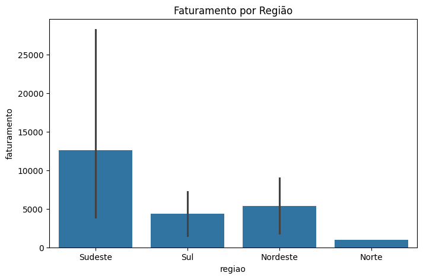

# 📊 Análise de Vendas

Projeto de análise exploratória de dados utilizando Python, Pandas, Matplotlib e Seaborn.

## 🔧 Tecnologias
- Python 3.11
- Pandas
- Matplotlib
- Seaborn

## 📈 Análises realizadas
- Cálculo de faturamento total
- Faturamento por categoria
- Faturamento por região
- Visualização gráfica dos resultados

## 📊 Exemplo de gráfico

